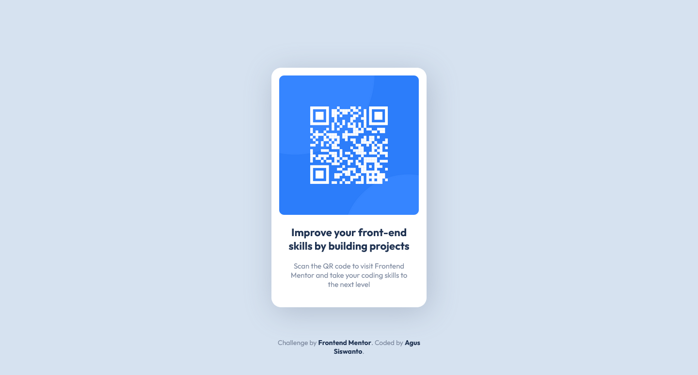

# Frontend Mentor - QR code component solution

This is a solution to the [QR code component challenge on Frontend Mentor](https://www.frontendmentor.io/challenges/qr-code-component-iux_sIO_H). Frontend Mentor challenges help you improve your coding skills by building realistic projects.

## Table of contents

- [Frontend Mentor - QR code component solution](#frontend-mentor---qr-code-component-solution)
  - [Table of contents](#table-of-contents)
  - [Overview](#overview)
    - [Screenshot](#screenshot)
    - [Links](#links)
  - [My process](#my-process)
    - [Built with](#built-with)
  - [Author](#author)

**Note: Delete this note and update the table of contents based on what sections you keep.**

## Overview

### Screenshot

### Links

- Solution URL: [Frontend Mentor Challenge Solution](https://www.frontendmentor.io/solutions/qr-code-component-using-css-grid-sass-and-bem-ug-lZybFUW)
- Live Site URL: [QR Code Component](https://fem-qr-code-component-good.netlify.app)

## My process

### Built with

- Semantic HTML5 markup
- SCSS/SASS
- CSS Grid
- Mobile-first workflow
- NPM Package dev dependency: vite, sass & autoprefixer for crossbrowser compatibility.

## Author

- Frontend Mentor - [@siswantodev](https://www.frontendmentor.io/profile/siswantodev)
